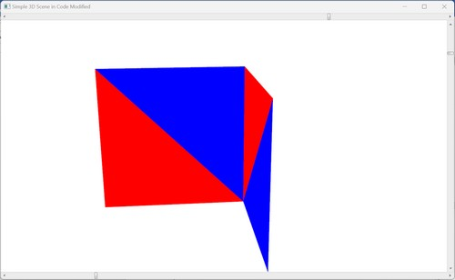
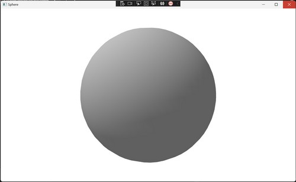

# C# WPF 3D Examples

**Examples**:
1. Simple 3D Scene (modified).
2. Pyramid.
3. Sphere.
4. Straight Pipe.
5. Straight Pipe with Curved Pipe.
6. Fractal Tree.
7. Cart.
8. Sun System.
9. Pipelines.

See code in `src` directory.  
Look at images in `img` directory.

## Simple 3D Scene (modified)

## Pyramid

### High-Level Pyramid

### Low-Level Pyramid

## Sphere and 3/4 of the sphere

## Straight Pipe: cylinder with bases, hollow cylinder and pipe

## Straight Pipe with Curved Pipe

## Fractal Tree

## Cart (with animation of movement)

## Sun System

## Pipelines

